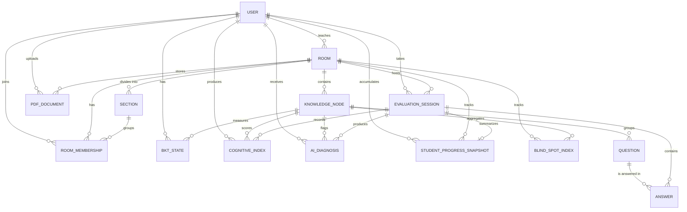

# Modelo de datos — CogniRoom

Este documento describe el esquema relacional **real y vigente** del sistema: tablas, atributos, restricciones y relaciones. Sirve como fuente para mantener el diagrama ER (`Diagrama_ER_CR_updated.drawio`).

> Los nombres de columna coinciden con los campos definidos en `apps/*/models.py`. Donde un modelo expone una **propiedad derivada** (no es columna en BD), se indica explícitamente.

## Diagrama entidad–relación



---

## 1. Módulo `users`

### `users_user`
Usuario del sistema. Extiende `AbstractUser` de Django.

| Campo | Tipo | Restricciones | Descripción |
|---|---|---|---|
| `id` | BigAutoField | PK | Identificador |
| `username` | CharField(150) | UNIQUE, NOT NULL | Generado automáticamente (no se pide al usuario) |
| `email` | EmailField | **UNIQUE**, NOT NULL | Correo institucional (login) |
| `password` | CharField(128) | NOT NULL | Hash de contraseña |
| `first_name` | CharField(150) | BLANK | Nombre(s) |
| `last_name` | CharField(150) | BLANK | Apellidos completos (`primer_apellido segundo_apellido`) |
| `role` | CharField(20) | CHOICES, default `student` | `student` / `teacher` / `coordinator` |
| `institution` | CharField(200) | BLANK | Institución educativa |
| `is_active` | Boolean | default True | — |
| `is_staff` / `is_superuser` | Boolean | default False | Heredados de AbstractUser |
| `date_joined` | DateTime | auto | Alta de la cuenta |
| `last_login` | DateTime | NULLABLE | Heredado de AbstractUser |

**Reglas de negocio:**
- `email` es **único** (no se permiten cuentas duplicadas; el login es por email).
- El **`username` se deriva** en el registro vía `User.generate_username(first_name, first_surname, second_surname)`: inicial del nombre + primer apellido + inicial del segundo apellido, normalizado a ASCII (`Ana García López` → `agarcial`). Si la base ya existe, agrega un sufijo numérico incremental (`agarcial`, `agarcial1`, …).
- `institution` es **FK a `Institution`** (catálogo gestionado desde el admin). El estudiante la elige de una lista; el docente queda vinculado al resolver su código.
- El registro público solo permite `student` y `teacher`; `coordinator` se crea por admin/seed. El alta como `teacher` exige el **código de su institución** (`Institution.teacher_code`, único por institución): el backend lo resuelve a la institución correspondiente y la asigna. El estudiante elige su institución del catálogo.

---

## 2. Módulo `rooms`

### `rooms_room`
Sala de aprendizaje. Puede ser grupal (con docente) o individual (autoestudio).

| Campo | Tipo | Restricciones | Descripción |
|---|---|---|---|
| `id` | BigAutoField | PK | — |
| `name` | CharField(200) | NOT NULL | Nombre visible |
| `subject` | CharField(200) | NOT NULL | Materia |
| `teacher_id` | FK → users_user | ON DELETE CASCADE | Docente dueño (en salas individuales, el propio alumno) |
| `mode` | CharField(20) | CHOICES, default `group` | `group` / `individual` |
| `access_code` | CharField(8) | UNIQUE, NULLABLE | Solo para salas `group` |
| `is_active` | Boolean | default True | — |
| `created_at` | DateTime | auto_now_add | — |

**Reglas de negocio:**
- Si `mode = group` y `access_code` vacío → auto-generado (8 chars alfanuméricos en `save()`).
- Si `mode = individual` → `access_code` queda NULL.

### `rooms_section`
Sub-grupo (curso paralelo) dentro de una sala. Soporta una misma materia dictada a varios cursos con horarios distintos.

| Campo | Tipo | Restricciones | Descripción |
|---|---|---|---|
| `id` | BigAutoField | PK | — |
| `room_id` | FK → rooms_room | ON DELETE CASCADE, NOT NULL | Sala dueña |
| `code` | CharField(20) | NOT NULL | Identificador corto ("A", "B", "C") |
| `name` | CharField(200) | NOT NULL | Nombre completo ("Curso A · L-M-V 10:00") |
| `schedule` | CharField(100) | BLANK, default '' | Horario libre, opcional |
| `capacity` | PositiveIntegerField | NULLABLE | Cupo máximo opcional |
| `is_active` | Boolean | default True | — |
| `created_at` | DateTime | auto_now_add | — |

**UNIQUE(`room_id`, `code`)** — el código del curso es único dentro de cada sala. `ordering = ['code']`.

### `rooms_roommembership`
Relación muchos-a-muchos entre salas grupales y estudiantes.

| Campo | Tipo | Restricciones | Descripción |
|---|---|---|---|
| `id` | BigAutoField | PK | — |
| `room_id` | FK → rooms_room | ON DELETE CASCADE | — |
| `student_id` | FK → users_user | ON DELETE CASCADE | — |
| `section_id` | FK → rooms_section | ON DELETE SET NULL, NULLABLE | Curso opcional dentro de la sala |
| `joined_at` | DateTime | auto_now_add | — |

**UNIQUE(`room_id`, `student_id`)** — un alumno no puede inscribirse dos veces.

**Reglas de negocio:**
- `section_id` es NULL cuando la sala no usa sub-grupos.
- Si se borra un `Section`, las membresías quedan en la sala con `section_id = NULL` (no se expulsa al alumno).

---

## 3. Módulo `questions`

### `questions_knowledgenode`
Nodo de conocimiento (tema) dentro de una sala.

| Campo | Tipo | Restricciones | Descripción |
|---|---|---|---|
| `id` | BigAutoField | PK | — |
| `room_id` | FK → rooms_room | ON DELETE CASCADE | — |
| `name` | CharField(200) | NOT NULL | Ej: "Recursividad" |
| `created_at` | DateTime | auto_now_add | — |

### `questions_pdfdocument`
Documento PDF subido como fuente de generación de preguntas.

| Campo | Tipo | Restricciones | Descripción |
|---|---|---|---|
| `id` | BigAutoField | PK | — |
| `room_id` | FK → rooms_room | ON DELETE CASCADE | — |
| `uploaded_by_id` | FK → users_user | ON DELETE CASCADE | — |
| `file_path` | FileField(500) | NOT NULL | Almacenado en `media/pdfs/room_<id>/` |
| `extracted_text` | TextField | BLANK | Texto extraído por `pdfplumber` |
| `status` | CharField(12) | CHOICES, default `uploaded` | `uploaded` / `processing` / `processed` / `failed` |
| `created_at` | DateTime | auto_now_add | — |

> `processed` es una **propiedad derivada** (`status == 'processed'`), no una columna.

### `questions_question`
Pregunta de opción múltiple.

| Campo | Tipo | Restricciones | Descripción |
|---|---|---|---|
| `id` | BigAutoField | PK | — |
| `node_id` | FK → questions_knowledgenode | ON DELETE CASCADE | — |
| `statement` | TextField | NOT NULL | Enunciado |
| `difficulty` | CharField(10) | CHOICES | `easy` / `medium` / `hard` |
| `options` | JSONField | NOT NULL | Array de exactamente 4 strings |
| `correct_index` | IntegerField | 0..3 | Índice de la opción correcta |
| `source` | CharField(10) | CHOICES, default `ai` | `ai` / `manual` |
| `status` | CharField(10) | CHOICES, default `pending` | `pending` / `approved` / `rejected` |
| `created_at` | DateTime | auto_now_add | — |

> `is_approved` es una **propiedad derivada** (`status == 'approved'`), no una columna.

**Reglas de aprobación (en `save()` al crear):**
- `source = manual` → `status = approved`.
- `source = ai` en sala `individual` → `status = approved`.
- `source = ai` en sala `group` → `status = pending` (requiere aprobación del docente).
- El docente puede pasar a `approved` o `rejected` desde el banco de preguntas.

---

## 4. Módulo `evaluation_sessions` (app `apps.sessions`)

> El `AppConfig` define `label = 'evaluation_sessions'` para no chocar con `django.contrib.sessions`. Las tablas usan el prefijo `evaluation_sessions_*`.

### `evaluation_sessions_evaluationsession`
Sesión de evaluación de un estudiante en una sala.

| Campo | Tipo | Restricciones | Descripción |
|---|---|---|---|
| `id` | BigAutoField | PK | — |
| `student_id` | FK → users_user | ON DELETE CASCADE | — |
| `room_id` | FK → rooms_room | ON DELETE CASCADE | — |
| `status` | CharField(20) | CHOICES, default `active` | `active` / `completed` / `abandoned` / `expired` |
| `started_at` | DateTime | auto_now_add | — |
| `finished_at` | DateTime | NULLABLE | Se llena al completar |

### `evaluation_sessions_answer`
Respuesta individual a una pregunta dentro de una sesión. (En el diagrama figura como `student_response`.)

| Campo | Tipo | Restricciones | Descripción |
|---|---|---|---|
| `id` | BigAutoField | PK | — |
| `session_id` | FK → evaluation_sessions_evaluationsession | ON DELETE CASCADE | — |
| `question_id` | FK → questions_question | ON DELETE CASCADE | — |
| `selected_index` | IntegerField | 0..3 | Opción elegida |
| `is_correct` | Boolean | NOT NULL | Calculado en backend |
| `confidence_declared` | FloatField | 0.0..1.0 | Confianza declarada por el estudiante |
| `bkt_mastery_snapshot` | FloatField | default 0.0 | Mastery BKT **al momento de responder** (para reconstruir la curva) |
| `response_time_sec` | IntegerField | default 0 | Tiempo de respuesta en segundos |
| `ai_feedback` | TextField | BLANK | Explicación IA si ICC < 0.5 |
| `answered_at` | DateTime | auto_now_add | — |

---

## 5. Módulo `cognitive`

### `cognitive_bktstate`
Estado BKT (dominio real) de un estudiante en un nodo.

| Campo | Tipo | Restricciones | Descripción |
|---|---|---|---|
| `id` | BigAutoField | PK | — |
| `student_id` | FK → users_user | ON DELETE CASCADE | — |
| `node_id` | FK → questions_knowledgenode | ON DELETE CASCADE | — |
| `p_mastery` | FloatField | default 0.3 | Probabilidad de dominio |
| `p_transit` | FloatField | default 0.09 | P(aprendizaje por intento) |
| `p_slip` | FloatField | default 0.1 | P(fallar sabiendo) |
| `p_guess` | FloatField | default 0.2 | P(acertar sin saber) |
| `attempts` | IntegerField | default 0 | Intentos totales |
| `updated_at` | DateTime | auto_now | — |

**UNIQUE(`student_id`, `node_id`)** — un solo estado BKT por par estudiante-nodo.

### `cognitive_cognitiveindex`
Snapshot histórico del ICC por respuesta.

| Campo | Tipo | Restricciones | Descripción |
|---|---|---|---|
| `id` | BigAutoField | PK | — |
| `student_id` | FK → users_user | ON DELETE CASCADE | — |
| `node_id` | FK → questions_knowledgenode | ON DELETE CASCADE | — |
| `session_id` | FK → evaluation_sessions_evaluationsession | ON DELETE SET NULL, NULLABLE | — |
| `avg_confidence` | FloatField | 0.0..1.0 | Confianza declarada en ese momento |
| `bkt_mastery` | FloatField | 0.0..1.0 | Snapshot del mastery en ese momento |
| `icc_value` | FloatField | 0.0..1.0 | 1 − \|metacognitive_gap\| |
| `metacognitive_gap` | FloatField | −1.0..1.0 | `avg_confidence − bkt_mastery` |
| `profile` | CharField(20) | CHOICES | `overconfident` / `underconfident` / `calibrated` |
| `calculated_at` | DateTime | auto_now_add | — |

### `cognitive_blindspotindex`
Índice IPC (Punto Ciego Colectivo) por nodo y sala.

| Campo | Tipo | Restricciones | Descripción |
|---|---|---|---|
| `id` | BigAutoField | PK | — |
| `node_id` | FK → questions_knowledgenode | ON DELETE CASCADE | — |
| `room_id` | FK → rooms_room | ON DELETE CASCADE | — |
| `ipc_value` | FloatField | 0.0..1.0 | Promedio de ICC del aula en ese nodo |
| `total_student` | IntegerField | NOT NULL | Nº estudiantes que contribuyeron |
| `calculated_at` | DateTime | auto_now | — |

**Alerta**: si `ipc_value < 0.5` el nodo es un punto ciego colectivo.

### `cognitive_aidiagnosis`
Diagnóstico generado por IA cuando hay desalineación grave.

| Campo | Tipo | Restricciones | Descripción |
|---|---|---|---|
| `id` | BigAutoField | PK | — |
| `student_id` | FK → users_user | ON DELETE CASCADE | — |
| `session_id` | FK → evaluation_sessions_evaluationsession | ON DELETE SET NULL, NULLABLE | — |
| `node_id` | FK → questions_knowledgenode | ON DELETE SET NULL, NULLABLE | Nodo que disparó el diagnóstico |
| `classification` | CharField(20) | — | `overconfident` / `underconfident` / `calibrated` |
| `risk_level` | CharField(10) | CHOICES | `high` / `medium` / `low` |
| `risk_node` | JSONField | default [] | Array de nombres de nodos en riesgo |
| `failure_probability` | FloatField | 0.0..1.0 | Probabilidad predicha de fallo |
| `reasoning` | TextField | — | Razonamiento del modelo |
| `recommendation` | TextField | — | Acción sugerida |
| `generated_at` | DateTime | auto_now_add | — |

### `cognitive_studentprogresssnapshot`
Foto de la evolución cognitiva del estudiante **al cerrar cada sesión** (una fila por sesión completada). Fuente de las curvas de calibración/evolución en el tiempo.

| Campo | Tipo | Restricciones | Descripción |
|---|---|---|---|
| `id` | BigAutoField | PK | — |
| `student_id` | FK → users_user | ON DELETE CASCADE | — |
| `room_id` | FK → rooms_room | ON DELETE CASCADE | — |
| `session_id` | FK → evaluation_sessions_evaluationsession | ON DELETE SET NULL, NULLABLE | 1:1 lógico con la sesión |
| `avg_icc` | FloatField | 0.0..1.0 | ICC promedio de la sesión |
| `avg_bkt_mastery` | FloatField | 0.0..1.0 | Mastery promedio de la sesión |
| `avg_gap` | FloatField | −1.0..1.0 | Gap metacognitivo promedio |
| `dominant_profile` | CharField(20) | CHOICES | `overconfident` / `underconfident` / `calibrated` |
| `questions_answered` | IntegerField | NOT NULL | Preguntas respondidas en la sesión |
| `correct_count` | IntegerField | NOT NULL | Aciertos en la sesión |
| `created_at` | DateTime | auto_now_add | — |

`ordering = ['created_at']` · **Índice** sobre (`student_id`, `room_id`, `created_at`).

---

## Resumen de cardinalidades

| De | Relación | A |
|---|---|---|
| User | 1 ─ N | Room (como teacher) |
| User | N ─ N | Room (vía RoomMembership) |
| Room | 1 ─ N | Section |
| Section | 1 ─ N | RoomMembership (opcional) |
| Room | 1 ─ N | KnowledgeNode |
| Room | 1 ─ N | PDFDocument |
| KnowledgeNode | 1 ─ N | Question |
| User + KnowledgeNode | 1 ─ 1 | BKTState (unique) |
| User | 1 ─ N | EvaluationSession |
| EvaluationSession | 1 ─ N | Answer |
| Question | 1 ─ N | Answer |
| EvaluationSession | 1 ─ N | CognitiveIndex |
| Room + KnowledgeNode | 1 ─ 1 | BlindSpotIndex (lógicamente) |
| EvaluationSession | 1 ─ N | AIDiagnosis |
| KnowledgeNode | 1 ─ N | AIDiagnosis (FK opcional) |
| EvaluationSession | 1 ─ 1 | StudentProgressSnapshot (lógico) |
| User + Room | 1 ─ N | StudentProgressSnapshot |

---

## Índices recomendados (performance)

```sql
CREATE INDEX idx_answer_session       ON evaluation_sessions_answer(session_id);
CREATE INDEX idx_cogindex_student_node ON cognitive_cognitiveindex(student_id, node_id);
CREATE INDEX idx_bktstate_student     ON cognitive_bktstate(student_id);
CREATE INDEX idx_question_node_status ON questions_question(node_id, status);
CREATE INDEX idx_diagnosis_student_generated ON cognitive_aidiagnosis(student_id, generated_at DESC);
-- StudentProgressSnapshot ya define su índice en el modelo:
-- (student_id, room_id, created_at)
```

Django crea automáticamente índices sobre todas las FK. Los de arriba son complementarios para las consultas más frecuentes (respuestas de sesión, último diagnóstico, banco filtrado por estado, curva de evolución).

---

## Cambios respecto a versiones previas del esquema

Para quien actualice el diagrama ER desde una versión anterior:

- **`users_user.email`** ahora es **UNIQUE**; `username` se **deriva** (no se ingresa).
- **`questions_question`**: el booleano `is_approved` se reemplazó por **`status`** (`pending`/`approved`/`rejected`). `is_approved` quedó como propiedad derivada.
- **`questions_pdfdocument`**: el booleano `processed` se reemplazó por **`status`** (`uploaded`/`processing`/`processed`/`failed`). `processed` quedó como propiedad derivada.
- **`evaluation_sessions_evaluationsession.status`** sumó `abandoned` y `expired`.
- **`evaluation_sessions_answer`** sumó **`bkt_mastery_snapshot`**.
- **`cognitive_aidiagnosis`** sumó la FK **`node_id`** (nullable).
- **Nueva tabla `cognitive_studentprogresssnapshot`** (histórico por sesión).
