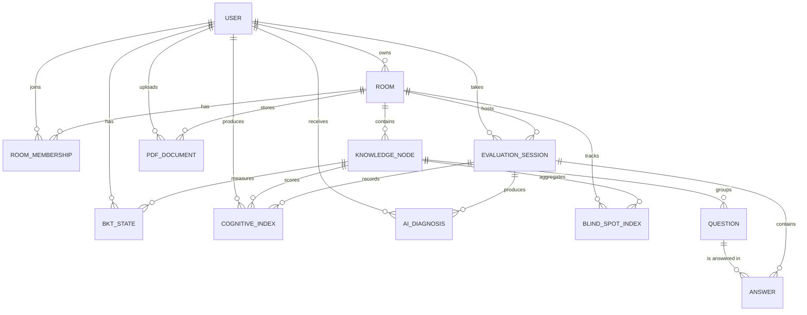

# Modelo de datos — CogniRoom

Este documento describe el esquema relacional del sistema, los atributos de cada tabla, restricciones y relaciones entre entidades.

## Diagrama entidad–relación



---

## 1. Módulo `users`

### `users_user`
Usuario del sistema. Extiende `AbstractUser` de Django.

| Campo | Tipo | Restricciones | Descripción |
|---|---|---|---|
| `id` | BigAutoField | PK | Identificador |
| `username` | CharField(150) | UNIQUE, NOT NULL | Usuario de login |
| `email` | EmailField | UNIQUE recomendado | Correo institucional |
| `password` | CharField(128) | NOT NULL | Hash de contraseña |
| `role` | CharField(20) | CHOICES | `student` / `teacher` / `coordinator` |
| `institution` | CharField(200) | BLANK | Institución educativa |
| `first_name` | CharField(150) | BLANK | — |
| `last_name` | CharField(150) | BLANK | — |
| `is_active` | Boolean | default True | — |
| `date_joined` | DateTime | auto | — |

---

## 2. Módulo `rooms`

### `rooms_room`
Sala de aprendizaje. Puede ser grupal (con docente) o individual (autoestudio).

| Campo | Tipo | Restricciones | Descripción |
|---|---|---|---|
| `id` | BigAutoField | PK | — |
| `name` | CharField(200) | NOT NULL | Nombre visible |
| `subject` | CharField(200) | NOT NULL | Materia |
| `owner_id` | FK → users_user | ON DELETE CASCADE | Dueño (docente si group, alumno si individual) |
| `mode` | CharField(20) | CHOICES | `group` / `individual` |
| `access_code` | CharField(8) | UNIQUE, NULLABLE | Solo para salas `group` |
| `is_active` | Boolean | default True | — |
| `created_at` | DateTime | auto_now_add | — |

**Reglas de negocio:**
- Si `mode = group` y `access_code` vacío → auto-generado (8 chars alfanuméricos).
- Si `mode = individual` → `access_code` queda NULL.

### `rooms_roommembership`
Relación muchos-a-muchos entre salas grupales y estudiantes.

| Campo | Tipo | Restricciones | Descripción |
|---|---|---|---|
| `id` | BigAutoField | PK | — |
| `room_id` | FK → rooms_room | ON DELETE CASCADE | — |
| `student_id` | FK → users_user | ON DELETE CASCADE | — |
| `joined_at` | DateTime | auto_now_add | — |

**UNIQUE(`room_id`, `student_id`)** — un alumno no puede inscribirse dos veces.

---

## 3. Módulo `questions`

### `questions_knowledgenode`
Nodo de conocimiento (tema) dentro de una sala.

| Campo | Tipo | Restricciones | Descripción |
|---|---|---|---|
| `id` | BigAutoField | PK | — |
| `room_id` | FK → rooms_room | ON DELETE CASCADE | — |
| `name` | CharField(200) | NOT NULL | Ej: "Recursividad" |
| `created_at` | DateTime | auto_now_add | — |

### `questions_pdfdocument`
Documento PDF subido como fuente de generación de preguntas.

| Campo | Tipo | Restricciones | Descripción |
|---|---|---|---|
| `id` | BigAutoField | PK | — |
| `room_id` | FK → rooms_room | ON DELETE CASCADE | — |
| `uploaded_by_id` | FK → users_user | ON DELETE CASCADE | — |
| `file_path` | FileField(500) | NOT NULL | Almacenado en `media/pdfs/room_<id>/` |
| `extracted_text` | TextField | BLANK | Texto extraído por `pdfplumber` |
| `processed` | Boolean | default False | True tras extracción exitosa |
| `created_at` | DateTime | auto_now_add | — |

### `questions_question`
Pregunta de opción múltiple.

| Campo | Tipo | Restricciones | Descripción |
|---|---|---|---|
| `id` | BigAutoField | PK | — |
| `node_id` | FK → questions_knowledgenode | ON DELETE CASCADE | — |
| `text` | TextField | NOT NULL | Enunciado |
| `difficulty` | CharField(10) | CHOICES | `easy` / `medium` / `hard` |
| `options` | JSONField | NOT NULL | Array de exactamente 4 strings |
| `correct_index` | IntegerField | 0..3 | Índice de la opción correcta |
| `source` | CharField(10) | CHOICES | `ai` / `manual` |
| `is_approved` | Boolean | default False | Filtro para salas grupales |
| `created_at` | DateTime | auto_now_add | — |

**Reglas de aprobación (en `save()`):**
- `source = manual` → `is_approved = True` siempre.
- `source = ai` en sala `individual` → `is_approved = True`.
- `source = ai` en sala `group` → `is_approved = False` (requiere aprobación batch del docente).

---

## 4. Módulo `evaluation_sessions` (app `apps.sessions`)

### `evaluation_sessions_evaluationsession`
Sesión de evaluación activa de un estudiante en una sala.

| Campo | Tipo | Restricciones | Descripción |
|---|---|---|---|
| `id` | BigAutoField | PK | — |
| `student_id` | FK → users_user | ON DELETE CASCADE | — |
| `room_id` | FK → rooms_room | ON DELETE CASCADE | — |
| `status` | CharField(20) | CHOICES | `active` / `completed` |
| `started_at` | DateTime | auto_now_add | — |
| `completed_at` | DateTime | NULLABLE | Se llena al completar |

### `evaluation_sessions_answer`
Respuesta individual a una pregunta dentro de una sesión.

| Campo | Tipo | Restricciones | Descripción |
|---|---|---|---|
| `id` | BigAutoField | PK | — |
| `session_id` | FK → evaluation_sessions_evaluationsession | ON DELETE CASCADE | — |
| `question_id` | FK → questions_question | ON DELETE CASCADE | — |
| `selected_index` | IntegerField | 0..3 | Opción elegida |
| `is_correct` | Boolean | NOT NULL | Calculado en backend |
| `declared_confidence` | FloatField | 0.0..1.0 | Confianza declarada |
| `response_time_seconds` | IntegerField | default 0 | Tiempo de respuesta |
| `ai_feedback` | TextField | BLANK | Explicación IA si ICC < 0.5 |
| `created_at` | DateTime | auto_now_add | — |

---

## 5. Módulo `cognitive`

### `cognitive_bktstate`
Estado BKT (dominio real) de un estudiante en un nodo.

| Campo | Tipo | Restricciones | Descripción |
|---|---|---|---|
| `id` | BigAutoField | PK | — |
| `student_id` | FK → users_user | ON DELETE CASCADE | — |
| `node_id` | FK → questions_knowledgenode | ON DELETE CASCADE | — |
| `p_mastery` | FloatField | default 0.3 | Probabilidad de dominio |
| `p_transit` | FloatField | default 0.09 | P(aprendizaje por intento) |
| `p_slip` | FloatField | default 0.1 | P(fallar sabiendo) |
| `p_guess` | FloatField | default 0.2 | P(acertar sin saber) |
| `attempts` | IntegerField | default 0 | Intentos totales |
| `updated_at` | DateTime | auto_now | — |

**UNIQUE(`student_id`, `node_id`)** — un solo estado BKT por par estudiante-nodo.

### `cognitive_cognitiveindex`
Snapshot histórico del ICC por respuesta.

| Campo | Tipo | Restricciones | Descripción |
|---|---|---|---|
| `id` | BigAutoField | PK | — |
| `student_id` | FK → users_user | ON DELETE CASCADE | — |
| `node_id` | FK → questions_knowledgenode | ON DELETE CASCADE | — |
| `session_id` | FK → evaluation_sessions_evaluationsession | ON DELETE SET NULL, NULLABLE | — |
| `declared_confidence` | FloatField | 0.0..1.0 | — |
| `bkt_mastery` | FloatField | 0.0..1.0 | Snapshot del mastery en ese momento |
| `icc` | FloatField | 0.0..1.0 | 1 − \|gap\| |
| `gap` | FloatField | −1.0..1.0 | confianza − mastery |
| `profile` | CharField(20) | CHOICES | `overconfident` / `underconfident` / `calibrated` |
| `created_at` | DateTime | auto_now_add | — |

### `cognitive_blindspotindex`
Índice IPC (Punto Ciego Colectivo) por nodo y sala.

| Campo | Tipo | Restricciones | Descripción |
|---|---|---|---|
| `id` | BigAutoField | PK | — |
| `node_id` | FK → questions_knowledgenode | ON DELETE CASCADE | — |
| `room_id` | FK → rooms_room | ON DELETE CASCADE | — |
| `ipc` | FloatField | 0.0..1.0 | Promedio de ICC del aula en ese nodo |
| `students_count` | IntegerField | NOT NULL | Nº estudiantes que contribuyeron |
| `calculated_at` | DateTime | auto_now | — |

**Alerta**: si `ipc < 0.5` el nodo es un punto ciego colectivo.

### `cognitive_aidiagnosis`
Diagnóstico generado por IA cuando hay desalineación grave.

| Campo | Tipo | Restricciones | Descripción |
|---|---|---|---|
| `id` | BigAutoField | PK | — |
| `student_id` | FK → users_user | ON DELETE CASCADE | — |
| `session_id` | FK → evaluation_sessions_evaluationsession | ON DELETE SET NULL, NULLABLE | — |
| `profile` | CharField(20) | — | `overconfident` / `underconfident` / `calibrated` |
| `risk_level` | CharField(10) | CHOICES | `high` / `medium` / `low` |
| `risk_nodes` | JSONField | default [] | Array de nombres de nodos en riesgo |
| `prediction` | FloatField | 0.0..1.0 | Probabilidad predicha de fallo |
| `reasoning` | TextField | — | Razonamiento del modelo |
| `recommendation` | TextField | — | Acción sugerida |
| `created_at` | DateTime | auto_now_add | — |

---

## Resumen de cardinalidades

| De | Relación | A |
|---|---|---|
| User | 1 ─ N | Room (como owner) |
| User | N ─ N | Room (vía RoomMembership) |
| Room | 1 ─ N | KnowledgeNode |
| Room | 1 ─ N | PDFDocument |
| KnowledgeNode | 1 ─ N | Question |
| User + KnowledgeNode | 1 ─ 1 | BKTState (unique) |
| User | 1 ─ N | EvaluationSession |
| EvaluationSession | 1 ─ N | Answer |
| Question | 1 ─ N | Answer |
| EvaluationSession | 1 ─ N | CognitiveIndex |
| Room + KnowledgeNode | 1 ─ 1 | BlindSpotIndex (lógicamente) |
| EvaluationSession | 1 ─ N | AIDiagnosis |

---

## Índices recomendados (performance)

```sql
CREATE INDEX idx_answer_session ON evaluation_sessions_answer(session_id);
CREATE INDEX idx_cogindex_student_node ON cognitive_cognitiveindex(student_id, node_id);
CREATE INDEX idx_bktstate_student ON cognitive_bktstate(student_id);
CREATE INDEX idx_question_node_approved ON questions_question(node_id, is_approved);
CREATE INDEX idx_diagnosis_student_created ON cognitive_aidiagnosis(student_id, created_at DESC);
```

Django crea automáticamente índices sobre todas las FK. Los de arriba son complementarios para las consultas más frecuentes (listar respuestas de sesión, obtener último diagnóstico, filtrar preguntas aprobadas por nodo).
