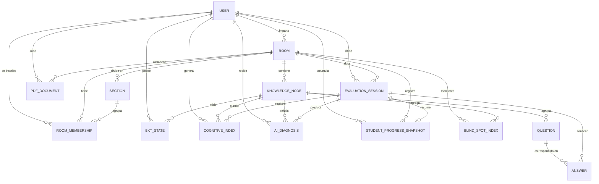

# Modelo Entidad-Relación (MER) de la base de datos

En este apartado se presenta el **modelo entidad-relación (MER)** que sustenta la base de datos de **CogniRoom**. El modelo fue diseñado para soportar el objetivo central del sistema: medir la **brecha metacognitiva** entre lo que el estudiante *cree saber* (confianza declarada) y lo que *realmente sabe* (dominio estimado mediante *Bayesian Knowledge Tracing*), conservando además el **histórico** necesario para reconstruir la evolución cognitiva a lo largo del tiempo. Se describen primero las entidades y sus campos más relevantes, luego las relaciones entre ellas y, finalmente, la forma en que el modelo lógico se implementó físicamente en el gestor **PostgreSQL** a través del ORM de Django.

El esquema está compuesto por **trece entidades** distribuidas en cinco módulos funcionales (`users`, `rooms`, `questions`, `evaluation_sessions` y `cognitive`). Esta organización modular permite que cada subsistema evolucione de forma independiente y refleja la separación de responsabilidades de la arquitectura de la aplicación.

---

## 1. Diagrama entidad-relación

El siguiente diagrama resume las entidades y sus cardinalidades. Cada relación se lee como "uno-a-muchos" (`||--o{`) salvo donde se indica una correspondencia uno-a-uno lógica (`||--o|`).

---

## 2. Tablas principales y campos más relevantes

### 2.1 Módulo de identidad (`users`)

**`user`** es la entidad raíz del sistema. Extiende el modelo `AbstractUser` de Django y representa a cualquier persona que interactúa con la plataforma. Sus campos más relevantes son:

- **`id_user`** (PK): identificador único.
- **`email`** (UNIQUE): correo institucional; constituye el identificador de inicio de sesión. Su unicidad garantiza que no existan cuentas duplicadas.
- **`username`**: se **deriva automáticamente** a partir del nombre y apellidos (inicial del nombre + primer apellido + inicial del segundo apellido, normalizado a ASCII); no se solicita al usuario.
- **`password`**: almacenado como *hash*, nunca en texto plano.
- **`role`**: discrimina el tipo de actor mediante un conjunto cerrado de valores (`student`, `teacher`, `coordinator`). Este campo es el eje de la autorización: define qué puede hacer cada usuario.
- **`institution`**, **`first_name`**, **`last_name`**, **`is_active`** y **`date_joined`** completan el perfil.

La entidad `user` cumple un doble papel según el contexto: como **docente** es dueña de salas y contenidos; como **estudiante** rinde sesiones de evaluación y acumula métricas cognitivas. Esta polivalencia se resuelve con el campo `role` y con relaciones diferenciadas, evitando duplicar la entidad.

### 2.2 Módulo de aulas (`rooms`)

**`room`** modela un espacio de aprendizaje. Sus campos clave son **`id_room`** (PK), **`name`**, **`subject`**, **`mode`** (`group` o `individual`) y **`access_code`** (UNIQUE, nullable). La FK **`id_teacher`** la vincula con el usuario propietario. El modo determina el comportamiento: una sala `group` genera automáticamente un código de acceso de 8 caracteres para que los estudiantes se inscriban, mientras que una sala `individual` (autoestudio) deja ese código nulo.

**`rooms_section`** representa un **sub-grupo o curso paralelo** dentro de una sala (por ejemplo, una misma materia dictada a los cursos "A", "B" y "C" con horarios distintos). Contiene **`code`**, **`name`**, **`schedule`** y **`capacity`**, con la restricción **UNIQUE(`room`, `code`)** que asegura que el código del curso sea único dentro de cada sala.

**`room_membership`** es la entidad asociativa que resuelve la relación **muchos-a-muchos** entre salas grupales y estudiantes. Almacena las FK **`id_room`** y **`id_student`**, la FK opcional **`id_section`** (curso al que pertenece el alumno) y la marca temporal **`joined_at`**. La restricción **UNIQUE(`room`, `student`)** impide que un alumno se inscriba dos veces en la misma sala.

### 2.3 Módulo de contenidos (`questions`)

**`knowledge_node`** (nodo de conocimiento) es la unidad temática fundamental: agrupa las preguntas de un tema concreto dentro de una sala (por ejemplo, "Recursividad"). Es una entidad pequeña pero **central**, porque todas las métricas cognitivas (BKT, ICC, puntos ciegos, diagnósticos) se calculan *por nodo*. Sus campos son **`id_node`** (PK), la FK **`id_room`** y **`name`**.

**`question`** almacena las preguntas de opción múltiple. Sus campos más relevantes son **`statement`** (enunciado), **`options`** (un campo **JSON** con exactamente cuatro alternativas), **`correct_index`** (0–3), **`difficulty`** (`easy`/`medium`/`hard`), **`source`** (`ai`/`manual`) y **`status`** (`pending`/`approved`/`rejected`). El uso de un campo JSON para las opciones evita crear una tabla adicional de alternativas, dado que el número siempre es fijo (cuatro). El campo `status` codifica el flujo de curación de preguntas: las manuales y las generadas por IA en salas individuales se aprueban automáticamente, mientras que las generadas por IA en salas grupales quedan pendientes hasta que el docente las apruebe o rechace.

**`pdf_document`** (presente en el modelo, fuente de generación con IA) guarda los PDF subidos por el docente. Sus campos son la ruta **`file_path`**, el **`extracted_text`** obtenido con `pdfplumber` y un **`status`** de procesamiento (`uploaded`/`processing`/`processed`/`failed`).

### 2.4 Módulo de evaluación (`evaluation_sessions`)

**`evaluation_session`** representa un intento de evaluación de un estudiante en una sala. Vincula al alumno (**`id_student`**) y la sala (**`id_room`**), y lleva un **`status`** (`active`/`completed`/`abandoned`/`expired`) junto con las marcas **`started_at`** y **`finished_at`**.

**`student_response`** (en el código, `Answer`) registra cada respuesta dentro de una sesión. Es una de las entidades más ricas del modelo porque captura el instante de la decisión cognitiva. Sus campos más relevantes son:

- **`selected_index`**: la opción elegida (0–3).
- **`is_correct`**: si la respuesta fue correcta (calculado en el backend).
- **`confidence_declared`** (0.0–1.0): **la confianza que el estudiante declara antes de conocer el resultado**. Este es el dato diferencial del sistema.
- **`bkt_mastery_snapshot`**: el dominio BKT **en el momento exacto de responder**, imprescindible para reconstruir la curva de aprendizaje *a posteriori* (puesto que `bkt_state` se sobrescribe).
- **`ai_feedback`**: explicación generada por IA cuando se detecta desalineación grave.
- **`response_time_sec`** y **`answered_at`** completan el registro.

### 2.5 Módulo cognitivo (`cognitive`)

Este módulo concentra la inteligencia analítica del sistema. Comprende cinco entidades:

**`bkt_state`** mantiene el **estado de dominio real** de un estudiante en un nodo, según el modelo *Bayesian Knowledge Tracing* (Corbett & Anderson, 1994). Almacena los cuatro parámetros del modelo —**`p_mastery`** (probabilidad de dominio), **`p_transit`** (aprendizaje por intento), **`p_slip`** (fallar sabiendo) y **`p_guess`** (acertar sin saber)— más el contador **`attempts`**. La restricción **UNIQUE(`student`, `node`)** garantiza un único estado por par estudiante-nodo, que se **actualiza** tras cada respuesta.

**`cognitive_index`** es un **snapshot histórico** del Índice de Calibración Cognitiva (ICC) calculado en cada respuesta. Guarda **`avg_confidence`**, **`bkt_mastery`**, **`icc_value`** (definido como `1 − |gap|`), **`metacognitive_gap`** (`avg_confidence − bkt_mastery`) y el **`profile`** resultante (`overconfident`, `underconfident` o `calibrated`). A diferencia de `bkt_state`, esta tabla **no se sobrescribe**: cada fila es un punto en el tiempo, lo que permite graficar la evolución de la calibración.

**`blind_spot_index`** agrega el ICC a nivel de aula. Su campo **`ipc_value`** es el promedio del ICC de todos los estudiantes en un nodo; cuando cae por debajo de 0.5, el nodo se considera un **punto ciego colectivo** (toda la clase está descalibrada en ese tema). Incluye **`total_student`** para registrar cuántos alumnos contribuyeron al cálculo.

**`ai_diagnosis`** almacena los diagnósticos generados por el modelo de IA (Claude) cuando se detecta una desalineación grave. Contiene la **`classification`** del perfil, el **`risk_level`** (`high`/`medium`/`low`), la **`failure_probability`** predicha, una lista JSON de nodos en riesgo (**`risk_node`**) y los textos del diagnóstico en dos audiencias: **`reasoning`** / **`recommendation`** para el docente (hablan del estudiante en tercera persona) y **`student_reasoning`** / **`student_recommendation`** para el propio estudiante (le hablan a él). La FK opcional **`id_node`** vincula el diagnóstico con el nodo que lo disparó.

**`student_progress_snapshot`** es la entidad de **histórico por sesión**: al cerrar cada sesión se escribe una fila con los promedios agregados (**`avg_icc`**, **`avg_bkt_mastery`**, **`avg_gap`**), el **`dominant_profile`** y los contadores **`questions_answered`** y **`correct_count`**. Es la fuente de las curvas de evolución temporal que ven el estudiante y el docente.

---

## 3. Relaciones entre entidades

El modelo articula sus relaciones alrededor de tres ejes: el **usuario**, la **sala** y el **nodo de conocimiento**.

**Desde el usuario.** Un `user` con rol docente **imparte** muchas salas (`user 1 ─ N room` a través de `id_teacher`). Como estudiante, participa en muchas salas mediante la entidad asociativa `room_membership`, que resuelve la cardinalidad **N:M** entre usuarios y salas. Además, un usuario **rinde** muchas sesiones de evaluación, **posee** un estado BKT por cada nodo que ha trabajado, **genera** múltiples índices cognitivos, **recibe** diagnósticos de IA y **acumula** snapshots de progreso.

**Desde la sala.** Una `room` **se divide en** secciones (`room 1 ─ N section`), **contiene** nodos de conocimiento, **almacena** documentos PDF, **aloja** sesiones de evaluación y **monitorea** sus puntos ciegos. La `section`, a su vez, **agrupa** membresías de forma opcional: un alumno puede pertenecer a un curso concreto o quedar sin sección asignada.

**Desde el nodo de conocimiento.** El `knowledge_node` es el pivote analítico: **agrupa** preguntas y, simultáneamente, **mide** estados BKT, **puntúa** índices cognitivos, **agrega** índices de punto ciego y **señala** diagnósticos. Esto refleja la decisión de diseño de que todas las métricas se calculen a nivel de tema, no de pregunta individual.

**En el flujo de evaluación.** Una `evaluation_session` **contiene** muchas respuestas (`student_response`), y cada `question` **es respondida en** múltiples respuestas a lo largo del tiempo y de distintos estudiantes. La sesión también **registra** índices cognitivos, **produce** diagnósticos de IA y **resume** su resultado en exactamente un `student_progress_snapshot` (relación 1:1 lógica).

La siguiente tabla resume las cardinalidades principales:

| De | Cardinalidad | A |
|---|---|---|
| User (docente) | 1 ─ N | Room |
| User ↔ Room | N ─ M | (vía Room_Membership) |
| Room | 1 ─ N | Section |
| Section | 1 ─ N | Room_Membership (opcional) |
| Room | 1 ─ N | Knowledge_Node |
| Knowledge_Node | 1 ─ N | Question |
| User + Knowledge_Node | 1 ─ 1 | BKT_State (único) |
| Evaluation_Session | 1 ─ N | Student_Response |
| Question | 1 ─ N | Student_Response |
| Evaluation_Session | 1 ─ N | Cognitive_Index |
| Room + Knowledge_Node | 1 ─ 1 | Blind_Spot_Index (lógico) |
| Evaluation_Session | 1 ─ N | AI_Diagnosis |
| Evaluation_Session | 1 ─ 1 | Student_Progress_Snapshot |

---

## 4. Implementación física en PostgreSQL

El modelo lógico descrito se materializó en el gestor **PostgreSQL 14+** utilizando el **ORM de Django 5.1**, que traduce cada clase de modelo (`models.Model`) a una tabla relacional y aplica las restricciones de forma declarativa mediante el sistema de **migraciones**. Las decisiones de implementación más relevantes son las siguientes:

**Nomenclatura de tablas.** Django genera por defecto el nombre físico como `<app>_<modelo>` en minúsculas: por ejemplo, la entidad `user` se materializa como `users_user`, `room` como `rooms_room`, y la respuesta del estudiante (`Answer`) como `evaluation_sessions_answer`. Es importante notar que la aplicación de sesiones define un **label personalizado** (`evaluation_sessions`) para evitar la colisión con el módulo nativo `django.contrib.sessions`; por ello sus tablas llevan el prefijo `evaluation_sessions_*`.

**Claves primarias.** Todas las tablas usan una clave primaria **`BigAutoField`** autoincremental (entero de 64 bits) generada automáticamente por Django, lo que garantiza identificadores únicos y eficientes sin intervención manual.

**Claves foráneas e integridad referencial.** Cada relación se implementó como un campo `ForeignKey` que PostgreSQL traduce a una restricción `FOREIGN KEY`. Las políticas de borrado se eligieron según la semántica del dominio:

- **`ON DELETE CASCADE`** en las dependencias fuertes: si se elimina una sala, se eliminan sus nodos, membresías y sesiones; si se elimina un usuario, se eliminan sus respuestas y estados cognitivos.
- **`ON DELETE SET NULL`** en las relaciones débiles que deben preservar el histórico: la FK `section_id` de `room_membership` se anula si se borra el curso (sin expulsar al alumno de la sala), y las FK `session_id` y `node_id` de las tablas cognitivas se anulan para conservar el diagnóstico aunque desaparezca la sesión o el nodo origen.

**Restricciones de unicidad.** Se implementaron varias restricciones `UNIQUE` para garantizar la consistencia: `email` único en `users_user`; `UNIQUE(room, code)` en `rooms_section`; `UNIQUE(room, student)` en `room_membership`; y `UNIQUE(student, node)` en `bkt_state`. Estas restricciones se materializan como índices únicos en PostgreSQL.

**Tipos de datos especiales.** Las opciones de las preguntas y la lista de nodos en riesgo de los diagnósticos se almacenan en columnas **`JSONField`**, que PostgreSQL implementa de forma nativa como tipo `jsonb`, permitiendo guardar estructuras flexibles sin tablas auxiliares. Las probabilidades del modelo BKT y los índices ICC se almacenan como `FloatField` (`double precision`), y las marcas temporales como `timestamp` con valores automáticos (`auto_now_add` / `auto_now`).

**Índices de rendimiento.** Además de los índices que Django crea automáticamente sobre cada clave foránea, se definieron índices complementarios para las consultas más frecuentes, entre ellos un índice compuesto sobre (`student_id`, `room_id`, `created_at`) en `student_progress_snapshot` para acelerar la reconstrucción de las curvas de evolución, e índices sobre (`student_id`, `node_id`) en `cognitive_index` y sobre (`node_id`, `status`) en `question`. Esto optimiza las operaciones de mayor coste: el cálculo de métricas por estudiante y el filtrado del banco de preguntas por estado de aprobación.

**Reglas de negocio en el modelo.** Finalmente, ciertas reglas universales se implementaron directamente en el método `save()` de los modelos, de modo que se cumplen siempre independientemente del punto de entrada: la generación automática del `access_code` de las salas grupales, la derivación del `username`, y la asignación automática del `status` de aprobación de las preguntas según su origen y el modo de la sala.

En conjunto, esta implementación física traduce fielmente el modelo lógico, preserva la integridad referencial mediante restricciones declarativas y conserva el histórico necesario para el análisis longitudinal de la calibración cognitiva, que es la finalidad última del sistema.
